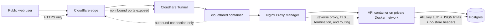

# home server server for backend services

This is the code for my personal backend server ran in docker containers in a lxc container.

I built it to avoid the bad free tiers on hosted backends and to make better use of my home server. The public API is exposed through Cloudflare Tunnels.

## How traffic reaches the server safely



The important part is that the home server does not need to expose the API directly to the public internet. Cloudflare handles the public entry point, the tunnel makes an outbound connection from inside the network, and Nginx Proxy Manager keeps routing private inside Docker.

## Run it

```powershell
cd /opt/server
cp .env.example .env
# optional: edit .env to set a real POSTGRES_PASSWORD and matching DATABASE_URL
docker compose up -d --build
docker compose ps
```
