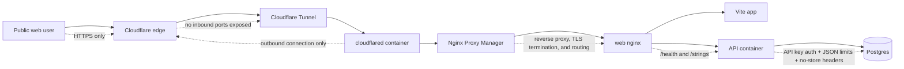

# OWS — Open Web Services

Self-hosted control plane for a Proxmox box. Phase 0 is a status console and a health API, running in Docker behind Cloudflare Tunnel and Nginx Proxy Manager.

The full product direction lives in [project_plan.md](project_plan.md).

## Traffic path

```
user -> Cloudflare -> tunnel -> NPM -> web (nginx) -> GET /health -> api
```

Point the NPM proxy host at **web port 80**, not `api:3000`. The UI is `/`. `/health` is proxied to the API.

## Run it

```bash
cd /opt/server
cp .env.example .env
# set TUNNEL_TOKEN for the Cloudflare tunnel
docker compose up -d --build
docker compose ps
```

`TUNNEL_TOKEN` is only required if you start `cloudflared`. Core stack is `api` + `web`.

## Test it

Same commands on the server and in GitHub Actions. Tests run inside Docker.

```bash
docker build --target test ./api
docker build --target test ./web
docker compose up -d --build api web
bash scripts/smoke.sh
```

The smoke script waits for `http://127.0.0.1:8080/health` and checks `ok` plus `service: ows-api`.

## home server server for backend services

This is the code for my personal backend server ran in docker containers in a lxc container.

I built it to avoid the bad free tiers on hosted backends and to make better use of my home server. The public API is exposed through Cloudflare Tunnels. The String Bay UI is served from the `web` container on the same Docker network.

## How traffic reaches the server safely


```mermaid
flowchart LR
 user[Public web user] --> cf[Cloudflare edge]
 cf --> tunnel[Cloudflare Tunnel]
 tunnel --> cloudflared[cloudflared container]
 cloudflared --> npm[Nginx Proxy Manager]
 npm --> web[web nginx]
 web --> spa[Vite app]
 web --> api[API container]
 api --> db[(Postgres)]

 user -. HTTPS only .-> cf
 cf -. no inbound ports exposed .-> tunnel
 cloudflared -. outbound connection only .-> cf
 npm -. reverse proxy, TLS termination, and routing .-> web
 web -. /health and /strings .-> api
 api -. API key auth + JSON limits + no-store headers .-> db
```

The home server does not need to expose the API directly to the public internet. Cloudflare is the public entry point, the tunnel makes an outbound connection from inside the network, and Nginx Proxy Manager keeps routing private inside Docker.

Point the NPM proxy host at **`web` port 80** (not `api:3000`). The UI is at `/`. `/health` and `/strings` still go to the API. Paste the API key in the UI; it stays in that browser tab and is never baked into the frontend build.

## Run it

```bash
cd /opt/server
cp .env.example .env
# optional: edit .env to set a real POSTGRES_PASSWORD and matching DATABASE_URL
docker compose up -d --build
docker compose ps
```
